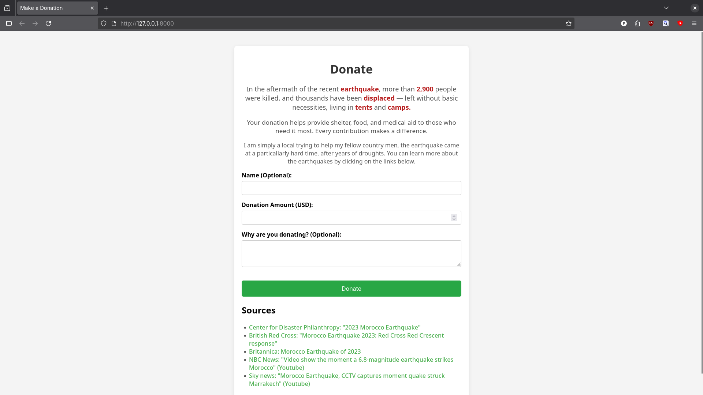
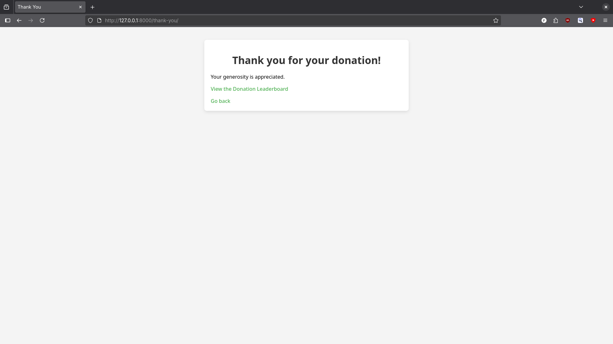
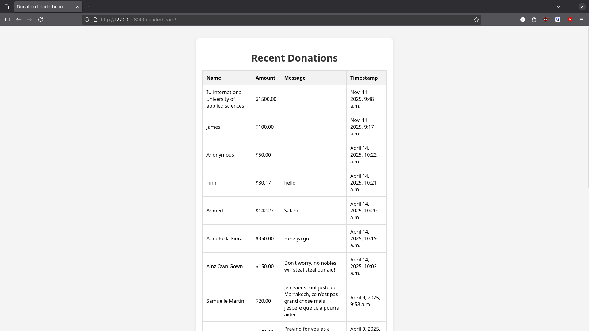

# Charity Donation Web App

A small Django web application that lets users submit donations and view a public leaderboard.


## Table of Contents
- [About](#about)
- [Features](#features)
- [Screenshots](#screenshots)
- [Installation](#installation)
- [Running the App](#running-the-app)
- [Project Structure](#project-structure)
- [Environment Variables](#environment-variables)
- [Requirements](#requirements)
- [License](#license)


## About

This is a lightweight Django project built to collect donations and display them on a leaderboard that requires minimal setup.  


## Features

- Submit donations with name, amount, and message  
- Anonymous donations supported  
- Responsive frontend  
- Leaderboard showing latest donations  
- Django admin panel included  


## Screenshots








## Installation

```bash
git clone https://github.com/yourusername/yourrepo.git
cd yourrepo

python -m venv venv
source venv/bin/activate  # Windows: venv\Scripts\activate

pip install -r requirements.txt
python manage.py migrate
```


## Running the App

Make sure your virtual environment is active and then run:

```bash
python manage.py runserver
```

Open in your browser:

```
http://127.0.0.1:8000/
```

Admin panel:

```
http://127.0.0.1:8000/admin/
```


## Requirements

Run `pip install -r requirements.txt`:


## License

This project is licensed under the MIT License.


## Contact

Feel free to reach out if you want to contribute or have questions.

